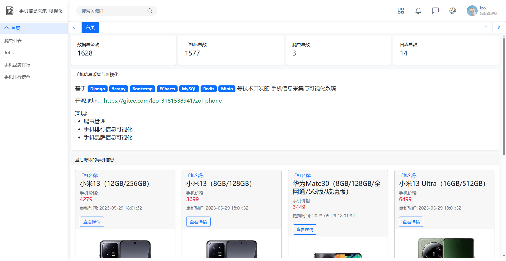
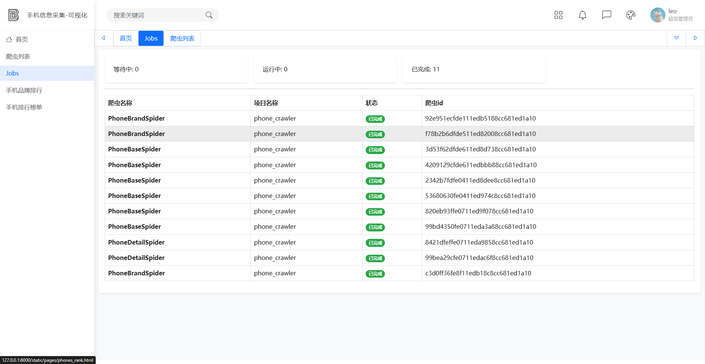
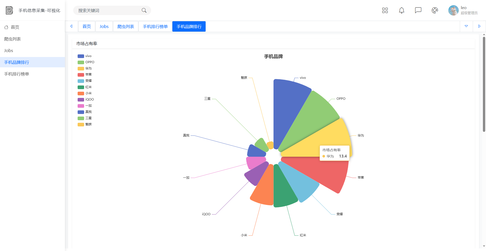
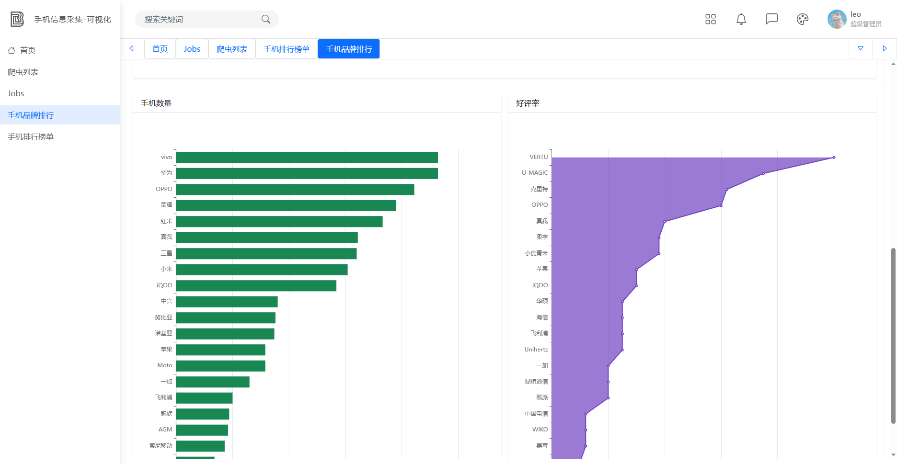
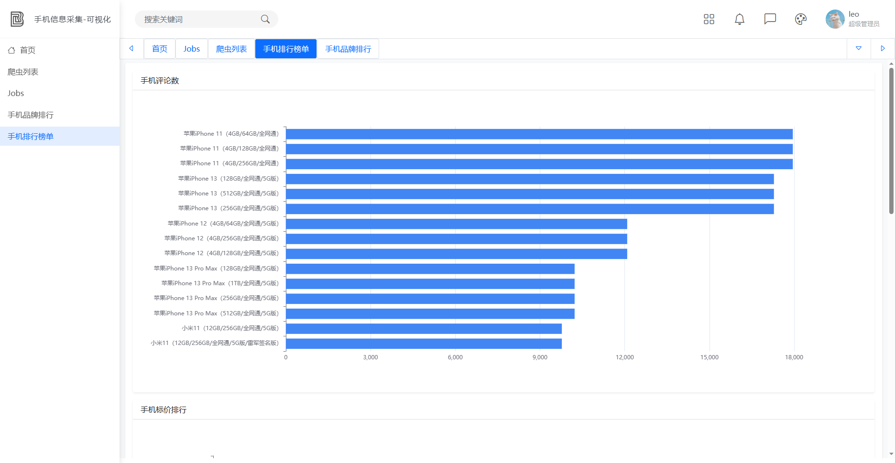
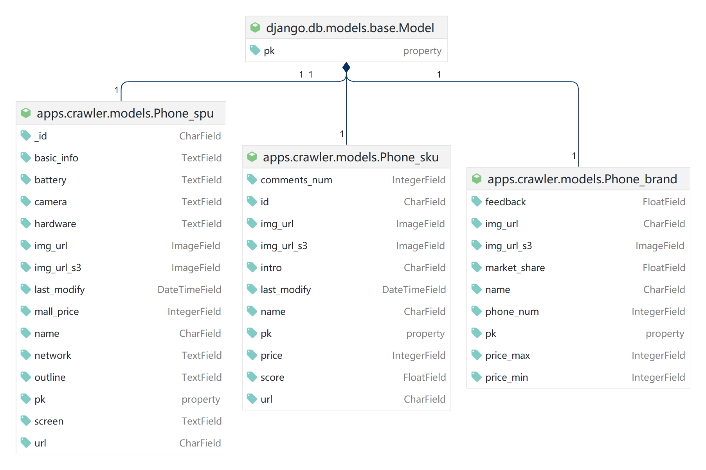

# 中关村在线 手机信息爬取

基于 Django Scrapy Bootstrap ECharts MySQL Redis Minio 等技术开发的 手机信息采集与可视化系统

前端页面使用 [欲饮琵琶码上催/bootstrap-admin](https://gitee.com/ajiho/bootstrap-admin.git) 模板

## 项目配置

```bash
pip install -r requirements.txt
```

更改`zol_phone.settings`中的数据库及对象存储配置

更改`apps.crawler.setting`中的爬虫配置
如果不想用对象存储, 可以将`IMAGES_STORE`更改为本地路径

## 项目简介

这个项目主要是一个爬虫管理系统，可以帮助用户管理爬虫任务，展示爬虫数据和手机品牌数据。具体功能包括：

1. 爬虫管理：用户可以通过爬虫列表实现手动启动某一爬虫。

2. 爬虫列表展示：用户可以查看所有爬虫的工作列表，包括爬虫名称、状态、编号等信息。

3. 手机品牌数据展示：用户可以查看手机品牌的数据，包括品牌名称、手机数量、市场占有率等信息。

4. 手机基本排行展示：用户可以查看手机的基本排行，包括销量排行、价格排行等信息。

通过这个项目，用户可以方便地启动和监控爬虫任务，同时也可以了解手机市场的情况，帮助用户做出更好的决策。

## 页面展示

首页



爬虫列表


爬虫任务列表



手机品牌市场占有率



手机品牌数量好评率排行



手机评论数排行



手机京东售价排行


数据库模型关系




## 总结

### 报错 Refused to display 'http://127.0.0.1:8000/ in a frame because it set 'X-Frame-Option

将某个页面放到框架中报错,

### Django Scrapy apps.*.models 兼容问题

https://www.cnblogs.com/lewangchen/p/15049778.html

删除apps.your_app.apps.py中的内容, 使用项目根路径方式导入, INSTALLED_APPS中添加apps.your_app

**处理方法：**

1. 注释掉上面中间件，但是这样不好，容易出现中间人攻击。
   最好的方法：

```python
MIDDLEWARE = [
    ...,
    # 注释掉这一行
    'django.middleware.clickjacking.XFrameOptionsMiddleware',
]
```

2. 在view中添加装饰器

```python
from django.shortcuts import render
from django.views.decorators.clickjacking import xframe_options_exempt


@xframe_options_exempt
def add_staff(request):
    return render(request, 'login/admin-list.html')


class SpiderView(View):
    @xframe_options_exempt
    def get(self, request):
        return render(request, 'spiders_list.html')

```

3. 在setting中设置：

X_FRAME_OPTIONS = 'SAMEORIGIN'

> X-Frame-Options 有三个值:
> DENY ：表示该页面不允许在 frame 中展示，即便是在相同域名的页面中嵌套也不允许
> SAMEORIGIN ：表示该页面可以在相同域名页面的 frame 中展示
> ALLOW-FROM uri ：表示该页面可以在指定来源的 frame 中展示
> 换一句话说，如果设置为 DENY，不光在别人的网站 frame 嵌入时会无法加载，在同域名页面中同样会无法加载。
> 另一方面，如果设置为 SAMEORIGIN，那么页面就可以在同域名页面的 frame 中嵌套。